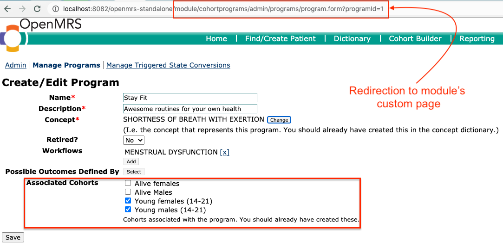

Cohort Based Programs Module
============================

Description
-----------
This module enhances the program management by allowing association of a program with cohorts. Consequently a patient can be enrolled in a program only if s/he belongs to any of cohorts linked with the program. The module modifies the program creation/editing legacy UI and also the behaviour of the program enrollment on the patient dashboard.

Implementation
--------------
The features in the module are achieved by introducing a new table named `cohortprograms\_program\_cohort` which links program with its associated cohorts. The module works by redirecting the program creation/editing page to a custom version which includes the ability to associate a program with cohorts. See the difference between the pages displayed with & without the module running.

**Note:** The cohort should already be configured. The cohorts can be created using the *Reporting compatibility module*

### Program Creation/Editing page while the module is not running

### Program Creation/Editing page while the module is running.

### Program enrollment for a patient belonging to cohort associated with the program.
The program *Stay Fit* is associated with a cohort of young people of 14-21 years of age, while the program *Aproveite a vida* is free for any patient to enroll.

### Program enrollment for a patient not belonging to cohorts associated with *Stay Fit* program

Building from Source
--------------------
You will need to have Java 1.7+ and Maven 3.x+ installed.  Use the command 'mvn package' to 
compile and package the module.  The .omod file will be in the omod/target folder.

Alternatively you can add the snippet provided in the [Creating Modules](https://wiki.openmrs.org/x/cAEr) page to your 
omod/pom.xml and use the mvn command:

    mvn package -P deploy-web -D deploy.path="../../openmrs-1.11.x/webapp/src/main/webapp"

It will allow you to deploy any changes to your web 
resources such as jsp or js files without re-installing the module. The deploy path says 
where OpenMRS is deployed.

Installation
------------
1. Build the module to produce the .omod file.
2. Use the OpenMRS Administration > Manage Modules screen to upload and install the .omod file.

If uploads are not allowed from the web (changable via a runtime property), you can drop the omod
into the ~/.OpenMRS/modules folder.  (Where ~/.OpenMRS is assumed to be the Application 
Data Directory that the running openmrs is currently using.)  After putting the file in there 
simply restart OpenMRS/tomcat and the module will be loaded and started.
