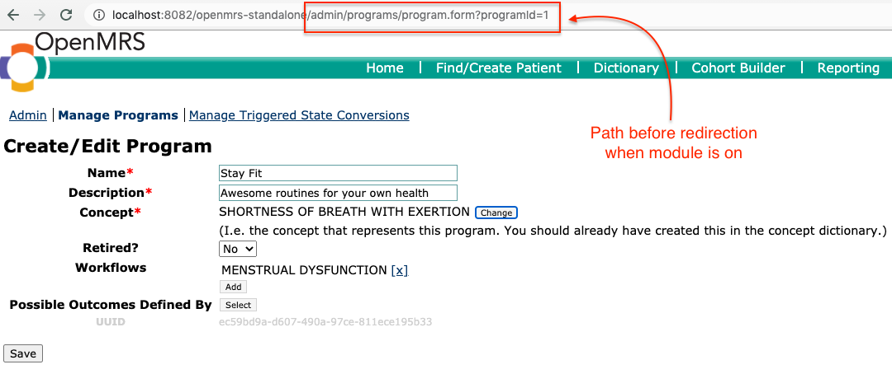
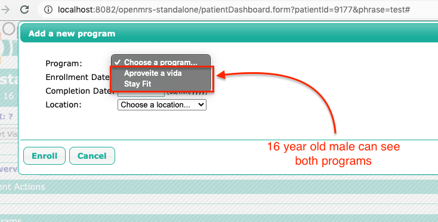
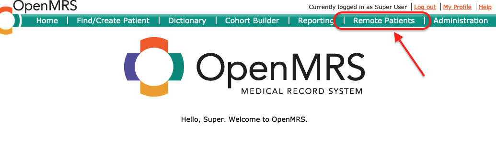

eSaude Features Module
============================

Description
-----------
This module houses eSaude general custom features that do not warrant a need for a new independent module by themselves.

Features
--------
1. Cohort Based Programs.
2. Remote Patient Search & Importing.

## 1. Cohort Based Programs
This feature enhances the program management by allowing association of a program with cohorts. Consequently a patient can be enrolled in a program only if s/he belongs to any of cohorts linked with the program. The module modifies the program creation/editing legacy UI and also the behaviour of the program enrollment on the patient dashboard.

### Implementation
The cohort based program features is achieved by introducing a new table named `esaudefeatures\_program\_cohort` which links program with its associated cohorts. The module works by redirecting the program creation/editing page to a custom version which includes the ability to associate a program with cohorts. See the difference between the pages displayed with & without the module running.

**Note:** The cohort should already be configured. The cohorts can be created using the *Reporting compatibility module*

### Program Creation/Editing page while the module is not running



### Program Creation/Editing page while the module is running.


### Program enrollment for a patient belonging to cohort associated with the program.
The program *Stay Fit* is associated with a cohort of young people of 14-21 years of age, while the program *Aproveite a vida* is free for any patient to enroll.



### Program enrollment for a patient not belonging to cohorts associated with *Stay Fit* program


## 2. Remote Patient Search & Importing.
This feature enables the user to configure a remote server (usually this is a central server that contains all patient in a particular catchment area such as a district or province). When adding a new patient, the user can search and confirm that the patient has not been created in another facility in the same catchment area. This is done by searching using either name or an identifier provided by the patient. If the user is satified that the records matches the patient details exactly then they can simply import the patient demographic information from the source instead of recreating the same information.

### Benefits
1. Reduces duplicates in a particular catchment area since an imported patient will be recognized as existing once the data is synchronized back to the central server.
2. Reduces human error since the information is automatically imported without any changes.

### Assumptions
Both the client and central server share the same metadata (that is things like patient identifier types,
relationship types, name validation logic, person attribute types).

### Implementation
This is implemented purely on the browser by performing rest calls for the fetch and data import.

### Requirements & Configuration
Both the client and server needs to be configured.

#### Client Machine Configuration
1. Client machine is configured with the remote server openmrs URL, username and password as global properties named "Remote Server Url", "Remote Server Username" and "Remote Server Password" respectively as it can be seen in the following screenshot.


2. Client machine needs to be running rest webservices module version 2.29+

#### Remote/Central Server Configuration
1. Server need to be running rest webservices module version 2.29+
2. Server need to be configured to support CORS.

##### CORS Configuration for Tomcat server.
[The information below is created from this page](http://software.dzhuvinov.com/cors-filter-installation.html)

1. Download the cors-filter-<version>.jar file and its java-property-utils-<version>.jar and put them into the CLASSPATH of Tomcat server by copying them into the director `$CATALINA_HOME/lib`.
2. Add CORS configuration (shown below) to the server `web.xml` file which is usually located in `$CATALINA_HOME/WEB_INF`

```
<filter>
		<!-- The CORS filter with parameters -->
		<filter-name>CORS</filter-name>
		<filter-class>com.thetransactioncompany.cors.CORSFilter</filter-class>
		
		<!-- Note: All parameters are options, if omitted the CORS 
		     Filter will fall back to the respective default values.
		  -->
		<init-param>
			<param-name>cors.allowOrigin</param-name>
			<param-value>*</param-value>
		</init-param>
		
        <init-param>
			<param-name>cors.allowGenericHttpRequests</param-name>
			<param-value>true</param-value>
		</init-param>

		<init-param>
			<param-name>cors.allowSubdomains</param-name>
			<param-value>false</param-value>
		</init-param>
		
		<init-param>
			<param-name>cors.supportedMethods</param-name>
			<param-value>GET, OPTIONS</param-value>
		</init-param>
		
		<init-param>
			<param-name>cors.supportedHeaders</param-name>
			<param-value>*</param-value>
		</init-param>
	</filter>

	<filter-mapping>
		<!-- CORS Filter mapping -->
		<filter-name>CORS</filter-name>
		<url-pattern>/*</url-pattern>
	</filter-mapping>
```

### Using Remote Patient Search
1. To access it use the menu "Remote Patients" On the Gutter as shown below.



Building from Source
--------------------
You will need to have Java 1.7+ and Maven 3.x+ installed.  Use the command 'mvn package' to 
compile and package the module.  The .omod file will be in the omod/target folder.

Alternatively you can add the snippet provided in the [Creating Modules](https://wiki.openmrs.org/x/cAEr) page to your 
omod/pom.xml and use the mvn command:

    mvn package -P deploy-web -D deploy.path="../../openmrs-1.11.x/webapp/src/main/webapp"

It will allow you to deploy any changes to your web 
resources such as jsp or js files without re-installing the module. The deploy path says 
where OpenMRS is deployed.

Installation
------------
1. Build the module to produce the .omod file.
2. Use the OpenMRS Administration > Manage Modules screen to upload and install the .omod file.

If uploads are not allowed from the web (changable via a runtime property), you can drop the omod
into the ~/.OpenMRS/modules folder.  (Where ~/.OpenMRS is assumed to be the Application 
Data Directory that the running openmrs is currently using.)  After putting the file in there 
simply restart OpenMRS/tomcat and the module will be loaded and started.
